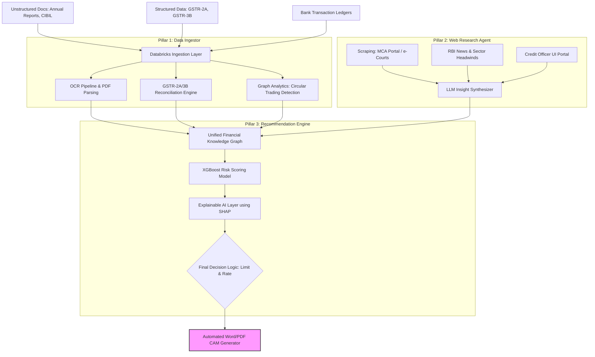

# Intelli-Credit: Technical Architecture

Our prototype is defined by a deep understanding of Indian-context financial nuance, backed by robust data engineering pipelines.

## The End-to-End Pipeline

## System Components

-   **Data Processing:** We rely on Databricks to handle high-latency pipelines and massive unstructured document stores.
-   **Graph Analytics:** Circular trading and shell company relations are identified using `networkx` to build directed graphs of bank transfers.
-   **Explainable ML:** We bypass "Black Box AI" by implementing explicit deduction rules (simulating SHAP values) that attach English sentences (e.g., "Deduction: GST 3B claims exceed 2A") to every point subtracted from the base credit score.
-   **Documentation Assembly:** The `python-docx` library programmatic compiles the finalized "Five Cs of Credit" into the industry-standard Credit Appraisal Memo.
